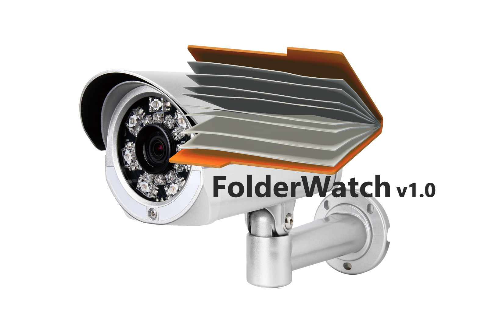
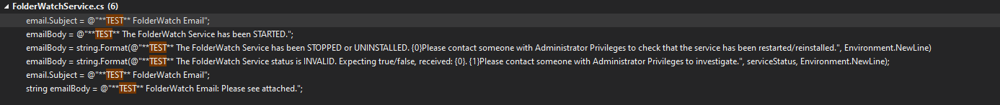

  

# What is it?
A Windows Service that is installed via a GUI. The Service monitors a user-specified folder for Excel files. When a new Excel file is placed in the folder, that file is automatically emailed to the specified list of recipients. Notifications via email about the Service starting or stopping are also automatically sent to the specified 'sender email address'.

# Requirements
A Windows 7/10 PC. It may work on other Windows OS's, but I have only tested it on 7 & 10. The Service also only works with NHS.NET addresses - it was made this way intentionally. 

# Installation
Firstly - Clone the repo.

Secondly, you may want to customise the notifications that are sent, which you can do by editing the following file (click on the image to make it bigger):

  

Following that, build and run!

# Screen Shots

  

  

  

  

