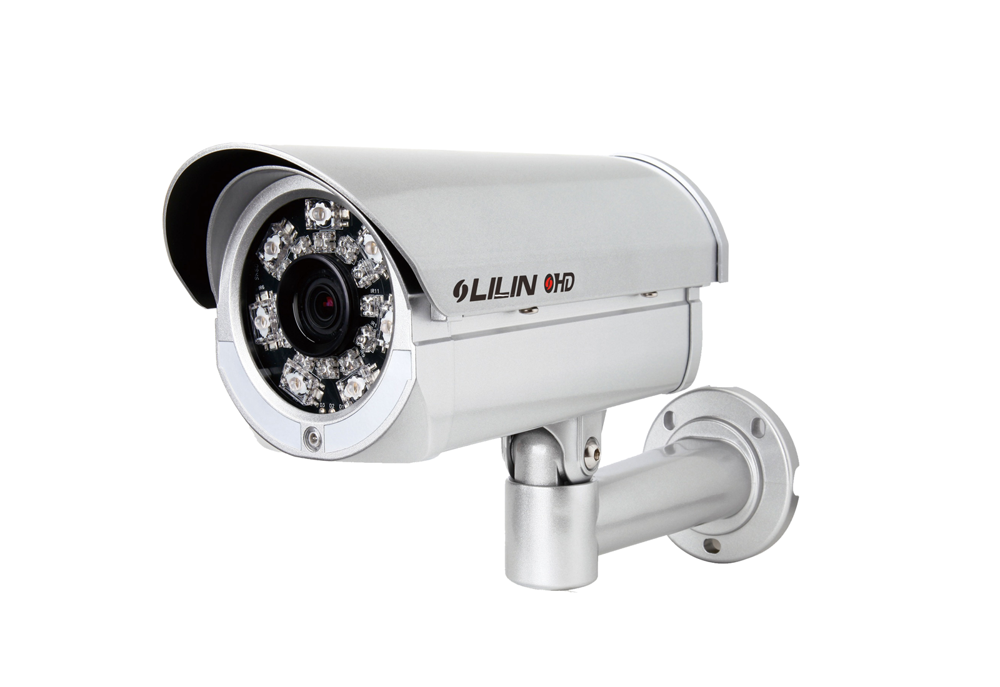

# FolderWatch

  

# What is it?
A Windows Service that is installed via a GUI. The Service monitors a user-specified folder for Excel files. When a new Excel file is placed in the folder, that file is automatically emailed to the specified list of recipients. Notifications via email about the Service starting or stopping are also automatically sent to the specified 'sender email address'.

# Screen Shots

  

  

  

  

